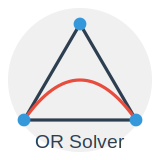

<div align="center">

# OR Solver



Powerful web-based Operations Research problem solver interface
[running in your browser](https://mst2k.github.io/programmierprojekt/)

[](https://github.com/mst2k/programmierprojekt/commits/main)
[](https://github.com/mst2k/programmierprojekt/issues)
[](https://github.com/mst2k/programmierprojekt/pulls)
[](https://github.com/mst2k/programmierprojekt/blob/main/LICENSE)

[Features](#features) • [Demo](#demo) • [Installation](#installation) • [Usage](#usage) • [Performance Testing](#performance-testing) • [Development](#development) •  [Testing](#testing) • [Contributing](#contributing) • [License](#license)

</div>

## Features

- 📊 Supports GMPL, LP, and MPS problem formats
- ⚡ Fast and efficient algorithms for quick solutions
- 🧩 Handles various OR problem types (General, Transport, Knapsack, Shift Plan)
- 🔧 Multiple solvers: GLPKHgourvest, GLPKJavil, Highs
- 🔄 Format conversion between different OR problem types
- 🌐 User-friendly web interface
- 🌍 Multi-language support (English, German)
- 📱 Responsive design for mobile and desktop
- 🌓 Dark mode for comfortable viewing

## Demo

<div align="center">
  
  <h2><a href="https://mst2k.github.io/programmierprojekt/">Try the OR Solver now!</a></h2>
</div>

## Installation

### Docker (Recommended)

The easiest way to run the application is using Docker.

```bash
docker run -d -p 5174:5174 --name orsolver mastrohm/orsolver
```

Access the application at `http://localhost:5174`

### Local Installation

Alternatively, you can run the application locally. Please refer to the [Development](#development) section for more details.


## Usage

To use the OR Solver:

1. Select the problem type (General, Transport, Knapsack, Shift Plan)
2. Choose a solver (GLPKHgourvest, GLPKJavil, Highs)
3. Input your problem in GMPL, LP, or MPS format
4. Click "Solve" to get results

## Performance Testing

We have implemented local performance tests to compare the efficiency of three open-source solver libraries (in JavaScript and WebAssembly formats) against their native counterparts. These tests help us evaluate the performance trade-offs of using web-based solver implementations.

Key aspects of our performance testing:
- Compares three solver libraries:
  - [GLPKHgourvest](https://github.com/hgourvest/glpk.js) (JavaScript)
  - [GLPKJavil](https://github.com/jvail/glpk.js/) (WebAssembly) 
  - [Highs](https://github.com/lovasoa/highs-js) (WebAssembly)
- Tests both JavaScript and WebAssembly (WASM) versions against native solver installations
- Evaluates performance across different problem types and sizes

For detailed information on how to run these tests and interpret the results, please refer to our [Performance Testing Guide](./performanceLocal/README.md).

These tests are crucial for:
- Quantifying the performance impact of using web-based solver libraries
- Understanding the trade-offs between different solver implementations
- Helping users make informed decisions about which solver to use for their specific needs

We encourage users and contributors to review these performance results and contribute to our testing efforts, helping us provide accurate performance insights for the OR community.

## Development

To setup the development environment, follow the steps below.

### Prerequisites

- Node.js (v14 or higher)
- npm (v6 or higher)

### Setup

1. Clone the repository:
   ```bash
   git clone https://github.com/mst2k/programmierprojekt.git
   ```

2. Change to the `frontend` directory:
   ```bash
   cd frontend
   ```

3. Install dependencies:
   ```bash
   npm install
   ```

4. Start the development server:
   ```bash
   npm run dev
   ```

5. Access the application at `http://localhost:5173/`

## Testing

Our project employs two types of tests to ensure code quality and functionality:

1. Unit Tests: For individual functions and methods
2. End-to-End (E2E) Tests: For full application workflows

Ensuring all tests pass before submitting a pull request is crucial for maintaining project stability.

#### Unit Tests

We use [Vitest](https://vitest.dev/) for unit testing.

To run unit tests:
```bash
npm run test
```

To generate a coverage report:
```bash
npm run coverage
```

#### E2E Tests

We use [Playwright](https://playwright.dev/) for E2E testing.

To run E2E tests:
```bash
npm run test-ct
```

To view the test report in your browser:
```bash
npx playwright show-report
```

#### Troubleshooting

If you encounter issues during testing:

- check if you are in the correct directory (`frontend`)

- Check the CLI output for specific error messages

- Consult the documentation of the testing libraries for more information:
   - [Vitest Documentation](https://vitest.dev/guide/)
   - [Playwright Documentation](https://playwright.dev/docs/test-components)

- Ensure all dependencies are correctly installed:

   ```bash
   npm i
   ```

#### Continuous Integration

Our CI pipeline runs all tests automatically for each pull request. Check the CI status and address any failures before requesting a review.

If you need assistance with testing or have questions about our testing strategy, don't hesitate to reach out to the project maintainers.

## Contributing

We welcome any contributions to the project. Whether you want to fix a bug, add a new feature, or improve the documentation, your help is appreciated. Please follow the guidelines below to contribute effectively. If you have any questions or need assistance, feel free to contact the project maintainers.

### How to Contribute

1. Fork the repository
2. Create a new branch (`git checkout -b feature/your-branch-name`)
3. Make your changes
4. Commit your changes (`git commit -am 'Add new feature'`)
5. Push to the branch (`git push origin feature/your-branch-name`)
6. Create a new Pull Request

### Commit Conventions

We follow [Conventional Commits](https://www.conventionalcommits.org/) guidelines. Examples:

- `feat: Add new user authentication`
- `fix: Resolve display issue in navigation bar`
- `docs: Update README with installation instructions`

## Tech Stack

- [Vite](https://vitejs.dev/) - Fast build tool
- [React](https://reactjs.org/) - JavaScript library
- [TypeScript](https://www.typescriptlang.org/) - Static typing
- [shadcn/ui](https://ui.shadcn.com/) - UI component library
- [Tailwind CSS](https://tailwindcss.com/) - Utility-first CSS framework
- [react-i18next](https://react.i18next.com/) - Internationalization
- [Vitest](https://vitest.dev/) - Unit testing
- [Playwright](https://playwright.dev/) - E2E testing
- [Docker](https://www.docker.com/) - Containerization

## License

This project is licensed under the GNU General Public License. See the [LICENSE](LICENSE) file for details.

Note: The solvers used in this project are from other open-source projects. We've built a web interface around these existing solvers.

## Acknowledgments

- University of Applied Sciences Osnabrück for academic support
- All contributors to the project
- The open-source community for the solvers that power our application

---

<br/>
<div align="center">
  <strong>OR Solver</strong> - Developed with ❤️ by students at the University of Applied Sciences Osnabrück
</div>